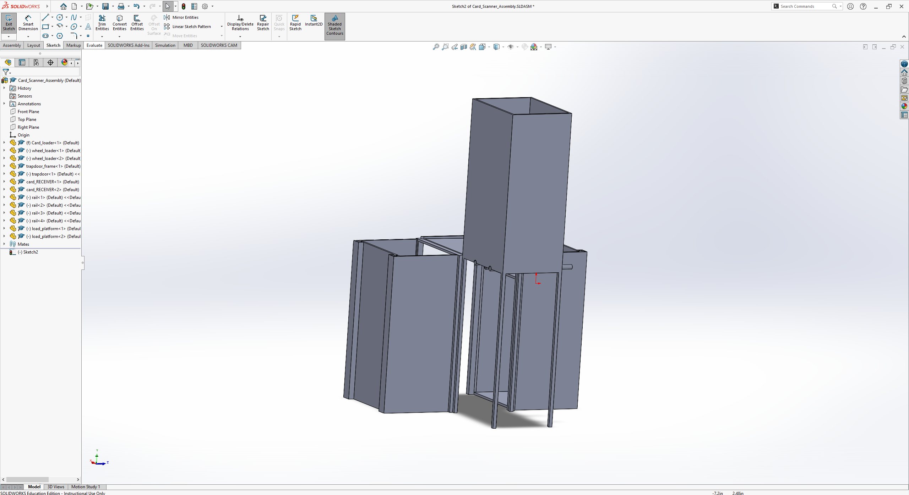
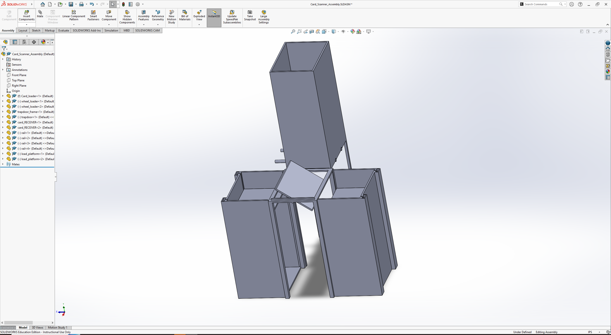
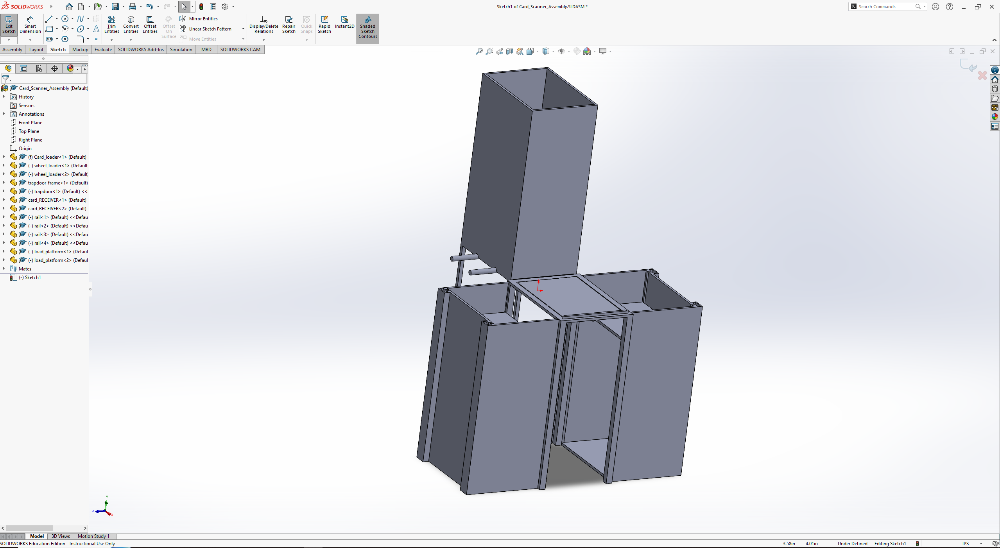

# ScrollRack Documentation

- [Introduction](#introduction)
- [longbox.js](#longboxjs)
  - [Express Server Setup](#express-server-setup)
  - [Server Start](#server-start)
  - [`validateCollectorNumber` Function](#validatecollectornumber-function)
  - [`addCard` Function](#addcard-function)
- [longbox.html](#longboxhtml)
  - [HTML Structure](#html-structure)
  - [Font Definition](#font-definition)
  - [Page Content](#page-content)
  - [Buttons](#buttons).
- [longbox.css](#longboxcss)
  - [Styling](#styling)
  - [Font Definition](#font-definition-css)
- [Database Design](#database-design)
  - [Schema](#schema)
  - [Views](#views)
- [Scryfall API](#scryfall-api)
- [Card Recognition](#card-recognition)
- [Machine Design](#machine-design)
  - [Framework](#framework)
- [Arduino Controls](#arduino-controls)
    - [Libraries](#libraries)
    - [Controlling Motors](#controlling-motors)

## Introduction

ScrollRack is a web application for organizing Magic: The Gathering cards.

## longbox.js

### Express Server Setup

In this part of the code, an Express.js server is configured to handle HTTP requests. It uses the `express` and `body-parser` libraries to create and parse requests.

### Server Start

This section initiates the Express server to listen on port 3000 for incoming requests. A console message confirms that the server is up and running. This is to be edited further when the .js can be fully implemented with the MySQL database.

### `validateCollectorNumber` Function

The `validateCollectorNumber` function validates the user's input for Collector's Number to ensure it contains only numeric characters. If the input is not valid, it displays a message and clears the input field.

### `addCard` Function

The `addCard` function retrieves user inputs for Collector's Number, Card Name, Color, and Mana Cost from the form. It then dynamically creates a new table row for the card, populates it with the entered values, and appends it to the card list table. Once a card is done adding, all fo the input fields are cleared.

### 'removeSelectedCards' Function

The removeSelectedCards function removes selected cards from the card list table. When the "Remove Cards" button is clicked, it checks for checkboxes that are marked as selected. If a card is selected, its table row is removed from the table.

### 'addToFolder' Function

The addToFolder function is intended to add selected cards to a folder, though the specific implementation details are not provided in this code snippet. It can be customized to handle card-to-folder interactions, such as creating a folder selection UI or processing folder data.

## longbox.html

### HTML Structure

This defines the HTML structure of the web page. It includes the layout for adding new cards and displaying the card list. It also links to external CSS and JavaScript files.

### Font Definition

Defines a custom font named 'Magic' using the `@font-face` rule and applies this font to the entire page.

### Page Content

Contains the main content of the web page, including the title, the form for adding cards, and the table for displaying the card list.

### New Buttons

"Remove Cards" and "Add to Folder," are buttons in the card list section to allow users to remove selected cards. The Add to Folder button will soon be coded through as a way of organizing the user's cards in the selected folder.

## longbox.css

### Styling

Defines the CSS styles for the web page. Styles the body, headings, form elements, buttons, and table headers, giving the page a coherent and visually appealing design.

## Database Design

The application and website both utilize a MySQL database that contains two tables.

### Schema

One table contain the list of all the user's cards (`user_cards`), which has primary keys `set_name` `collector_code` that are also foreign keys in the `api_dump` table. The `api_dump` table contains one entry for each datapoint in the Scryfall API (~450k objects).

### Views

There are two basic views for each table that simply displays all entries within.

## Scryfall API

Using the API avaiable on Scryfall.com, we are able to search for cards by different characteristics.

Here is a search for a card by its exact name, Mana Crypt.

## Card Recognition
Using Python and the openCV library, a camera is used to view the world in which a card is placed in its field of view.
There were difficulties finding good ways to implement the actual recognition of a card, so to this point (the first retro) the user can click a button when a card is in view and there is an attempt to scrape the text from the card that is visible. This information would then be parsed for useful text to be fed to the Scryfall API.

## Machine Design

### Framework

## Arduino Controls

Arduino utilizes a type of C++ code and it comes with built in functions for sending info over usb to a seperate computer. You use `digitalRead` on the arduino and `Serial` on the computer to be able to send information via usb. Then having a start button and a loop to count scanned cards and you are able to control the arduino.

### Libraries

It is import to have `stepper.h` in the arduino control script to be able to use the motors.

### Controlling motors

We have to assign a `step` and `direction` that matches the pins on the arduino for each stepper motor we have plugged into it. Once these are set you need to initialize the motors being used with `stepper()`. Then in our loop for counting cards, every 5 cards we can move the stepper motor by declaring a `step` and direction. So each step will raise or lower the platforms.

Check the wiki tab for more info or click [here](https://github.com/TroyChiasson/LongBox/wiki)!

